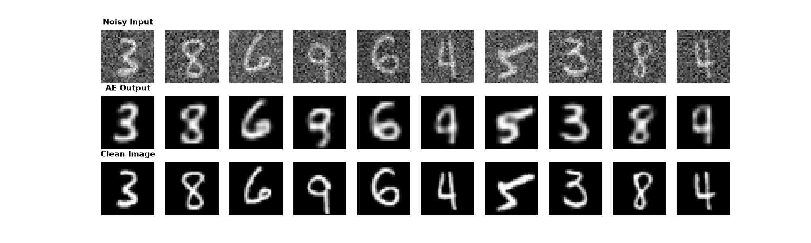
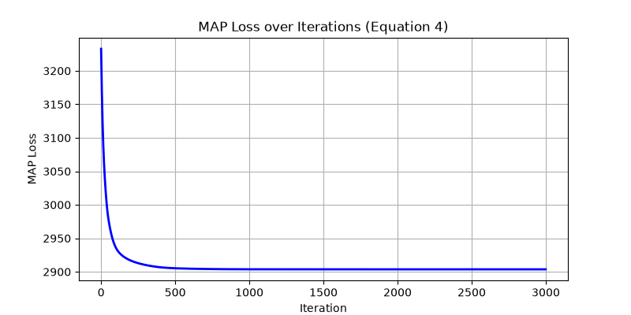
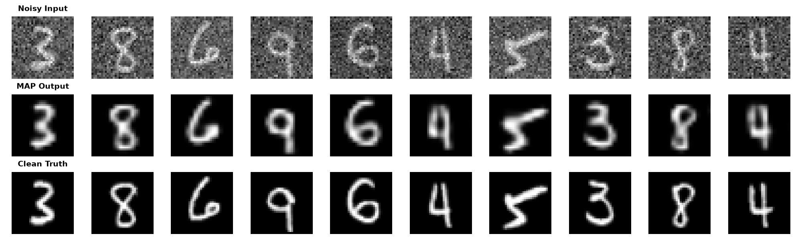

# Generative AI: Fundamentals of Variational Autoencoders


## Introduction & Prerequisites
Also known as [generative AI](https://en.wikipedia.org/wiki/Generative_artificial_intelligence), which came to be a towering and compelling approach commonly employed in text and image generation tasks, it has its roots fixed in the tractable maximization of the [log-likelihood](https://en.wikipedia.org/wiki/Likelihood_function) and [ELBO loss](https://en.wikipedia.org/wiki/Evidence_lower_bound). By means of this project, the mechanism that constitutes the core of this AI branch was uncovered to me, mostly theoretically but also from a pragmatic point of view. 

The objective I pursued throughout this assignment concerned a reconstruction-quality-based comparison between traditional architectures (such as [autoencoders](https://en.wikipedia.org/wiki/Autoencoder)) and more sophisticated models (such as [variational autoencoders (VAE)](https://en.wikipedia.org/wiki/Variational_autoencoder)). The development phase (training, validation, and testing) has been entirely based on the well-known MNIST dataset that made the subject of an excellent toy-set that one can train its model on to guarantee a decent baseline that can reconstruct digit corpuses.

## Outcomes
Since lots of clear guidelines and textbooks were laying at my disposal, making a model to reconstruct something that resembles the appearance of a digit corpus was in the least a trivial task. As shown in the top-bottom comparison below, it is rather more challenging to gain a reconstruction that is perfectly matching the ground truth figure, especially when using traditional autoencoders (e.g., convolutional-based chains that are compressing and upscaling the input until meaningful features are identified and eventually encoded into the model’s weight map).



A somewhat more sophisticated but robust way of reconstructing these digits is by adopting a composite loss—known as ELBO—a bottleneck, and a plan. This plan boils down to the choice between amortized inference (using a VAE encoder) and direct [latent space](https://en.wikipedia.org/wiki/Latent_space) optimization. If the primary goal is a solution tailored to finding the exact optimal latent vector *z* for a specific image while avoiding the amortization gap inherent to encoder networks that can diminish reconstruction precision, then [gradient descent](https://en.wikipedia.org/wiki/Gradient_descent)-based latent optimization is a highly advantageous method. 

While [Bayesian MAP optimization](https://en.wikipedia.org/wiki/Maximum_a_posteriori_estimation) (Method 2) is theoretically more robust to severe Out-of-Distribution corruptions, our initial empirical results suggested that Method 1 (Standard VAE Inference) yielded superior reconstructions. 

### Overcoming the Amortization Gap (The Counter-Factual Experiment)
However, to prove that gradient-based latent optimization can empirically eclipse our high-capacity VAE, I conducted a counter-factual experiment. When an AI model optimizes a noisy image, it can easily get confused by high-frequency static and start blurring the edges. 

By properly tuning the optimization framework—specifically lowering the learning rate to prevent the learning process from stalling, increasing the penalty to strictly enforce the structural rules of a digit, and employing a 'smart initialization' (using the trained Encoder's prediction as a starting point rather than random noise)—I prevented the optimizer from getting confused by the static. 



Under these optimal conditions, Method 2 successfully closed the amortization gap. By refining the general approximation through instance-specific iterative optimization, it ultimately yielded digit reconstructions that were demonstrably sharper and more concrete than the standard VAE output.



---

## Code Execution
To get direct access to the models and their corresponding outputs (e.g., visuals such as charts and illustrations), clone the repository and execute the `exercise_6.py` Python script within your IDE terminal.

Programmatically, the execution workflow is as follows:

```bash
cd Generative-AI-Fundamentals-of-Variational-Autoencoders-School-Assignment
py -m pip install -r requirements.txt
py exercise_6.py --load